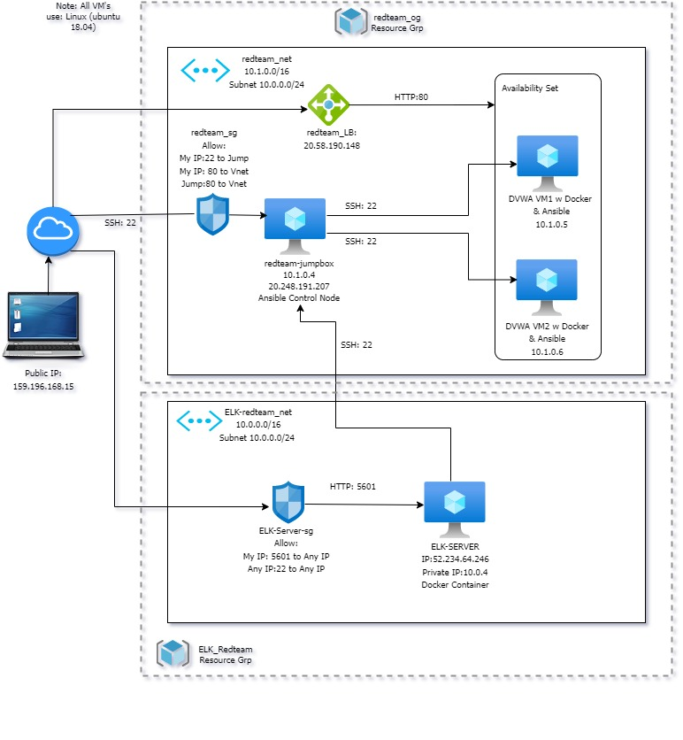

## Automated ELK Stack Deployment

The files in this repository were used to configure the network depicted below.

These files have been tested and used to generate a live ELK deployment on Azure. They can be used to either recreate the entire deployment pictured above. Alternatively, select portions of the _____ file may be used to install only certain pieces of it, such as Filebeat.
The following playbooks are required to configure DVWA and ELK Server.

  - [Filebeat Playbook](ansible/roles/filebeat-playbook.yml)
  - [ELK Playbook](ansible/elk-pentest.yml)
  - [DVWAY Playbook](ansible/pentest.yml)

This document contains the following details:
- Description of the Topology
- Access Policies
- ELK Configuration
  - Beats in Use
  - Machines Being Monitored
- How to Use the Ansible Build

### Description of the Topology

The main purpose of this network is to expose a load-balanced and monitored instance of DVWA, the D*mn Vulnerable Web Application.

Load balancing ensures that the application will be highly available, in addition to restricting inbound access to the network.
- Load Balancers(LBs) manage the information flow between server and an endpoint i.e. webservers in this case. They can conduct regular health checks to ensure servers can
can handle requests. In this same way, LBs can be used to defend an entity against distributed denial-of-service attacks. 
The jumpbox is a gateway between public and demilitarised zone and provides a security-hardened audit point for traffic.

Integrating an ELK server allows users to easily monitor the vulnerable VMs for changes to the file systems and system logs.
- Filebeat monitors the log files or locations that the user specifies, collects log events and forwards them to Elasticsearch or Logstash for indexing.
- Metricbeat takes the metrics and statistics that it collects from operating systems and services running on the server and ships them to the output that you specify, such as Elasticsearch or Logstash.

The configuration details of each machine may be found below.

| Name          | Function   | IP Address  | Operating System     |
|---------------|------------|-------------|----------------------|
|redteam-jumpbox|Gateway     |10.1.0.4     |Linux Ubuntu 18.04 LTS|
| DVWA-VM1      |Web Server  |10.1.0.5     |Linux Ubuntu 18.04 LTS|
| DVWA-VM2      |Web Server  |10.1.0.6     |Linux Ubuntu 18.04 LTS|
| ELK-Server    |Monitoring  |10.0.0.4     |Linux Ubuntu 18.04 LTS|

### Access Policies

The machines on the internal network are not exposed to the public Internet. 

Only the redteam-jumpbox virtual machine can accept connections from the Internet. Access to this machine is only allowed from the following IP addresses:
- Personal IP Address - 159.196.168.15

Machines within the network can only be accessed by the JumpBox and peer servers. Access to the ELK VM was allowed from the following IP:
- Personal IP Address (159.196.168.15) on port 5601

As well as any IP on port 22

A summary of the access policies in place can be found in the table below.

| Name          |Publicly Accessible | Allowed IP Addresses       |
|---------------|--------------------|----------------------------|
|redteam-jumpbox|     Yes            |159.196.168.15              |
| DVWA-VM1      |     No             |10.1.0.4                    |
| DVWA-VM2      |     No             |10.1.0.4                    |
| ELK-Server    |     Yes            |159.196.168.15:5601         |

### Elk Configuration

Ansible was used to automate configuration of the ELK machine. No configuration was performed manually, which is advantageous because...
- The main advantage of automating configuration with Ansible is that it's scalable. A user can deploy an entire app environment from a 
single point and customise or update as required, instead of having to go into each and every machine etc. to update e.g. SSH keys,
python versions, install new packages etc. These settings can be deployed across multiple machines from an Ansible playbook. No custom code required!

The playbook implements the following tasks:

- Installs Docker & Python3
- Increases VM memory
- Downloads the Docker image
- Launches a Docker container

The following screenshot displays the result of running `docker ps` after successfully configuring the ELK instance.

(Images/docker_ps_output.jpg)

### Target Machines & Beats
This ELK server is configured to monitor the following machines:

| Name          | Function   | IP Address  | Operating System     |
|---------------|------------|-------------|----------------------|
| DVWA-VM1      |Web Server  |10.1.0.5     |Linux Ubuntu 18.04 LTS|
| DVWA-VM2      |Web Server  |10.1.0.6     |Linux Ubuntu 18.04 LTS|

We have installed the following Beats on these machines:
- Filebeats

These Beats allow us to collect the following information from each machine:
- The Filebeat Elasticsearch module can handle audit logs, deprecation logs, server logs, and slow logs. Audit logs provide traceability for all changes done by various features within Azure AD.
Meanwhile slow logs help users troubleshoot the slowness of the write path (index) or the read path (search). 

### Using the Playbook
In order to use the playbook, you will need to have an Ansible control node already configured. Assuming you have such a control node provisioned: 

SSH into the control node and follow the steps below:
- Copy the filebeat_config.yml file, by running this curl command: `https://gist.githubusercontent.com/slape/5cc350109583af6cbe577bbcc0710c93/raw/eca603b72586fbe148c11f9c87bf96a63cb25760/Filebeat >> /etc/ansible/filebeat-config.yml` to `/etc/ansible`.
- Update the hosts file with your ELK-Server IP address under [ELK-Server] (which is also added) as this will be listed in filebeat playbook header to make sure that is where it is run.
- Update the filebeat config file to include the private IP of ELK Server in Elasticsearch and Kibana sections (line 1106 and 1806 respectively)
- Run the playbook via this command: `ansible-playbook <filename>.yml` and navigate to `http://[your.VM.IP]:5601/app/kibana` to check that the installation worked as expected.

Sources:
https://mincong.io/en/slow-logs-in-elasticsearch/
https://www.elastic.co/guide/en/beats/filebeat
https://www.simplilearn.com/tutorials/ansible-tutorial
https://avinetworks.com/what-is-load-balancing
